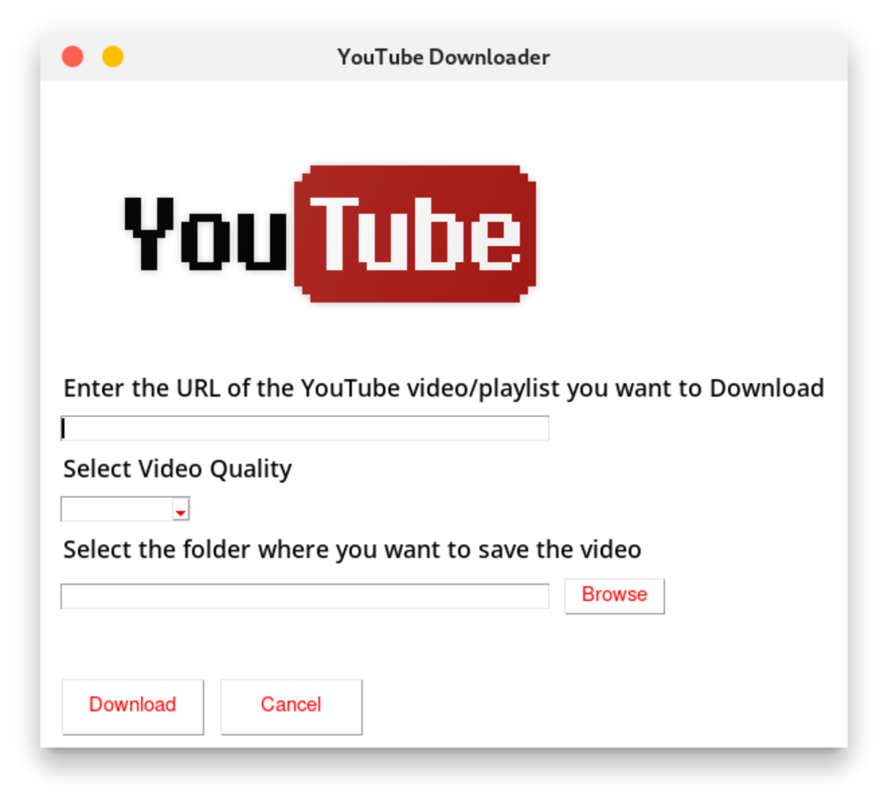

# YouTube Downloader
[](https://www.youtube.com)

Hello there just a simple project that can download videos or playlist from YouTube. This project is made using Python.

## Dependencies

To install the prerequisites run the following command in your terminal

```pip install -r requirements.txt```

Dependencies
- pytube
- PySimpleGUI


## How to Run the project?
Just dobule click the `main.pyw` 

`.pyw` file is a Python script that runs without opening a console window, typically used for GUI applications or background tasks.

If it does not run then depending on you OS you can run it from either launch.bat or launch.sh file.
- Windows Users run the `launch.bat` file
- Linux/Mac Peps run the `launch.sh` file and remember to give it executable permissions.(Using `chmod +x launch.sh`)

Make sure to install the prerequisites before running the project.

## Screenshot


## Bonus Tip
If you want to add this project like a software in your PC then you can do so by creating a shortcut of the `launch.bat` file and then moving it to `C:\Users\{YouCoolUsername}\AppData\Microsoft\Windows\Start Menu\Programs\` folder. This will make the program appear in Start Menu.

Linux Users make a .desktop file and move it to `/usr/share/applications/` folder (I hope you know how to do that. You use Linux bruh).

Mac Users ... Cry in a corner[.](https://sveinbjorn.org/platypus)

## Contributions

Hell yeah! You can contribute to this project by adding new features or fixing bugs. Just fork the repo and make a PR.