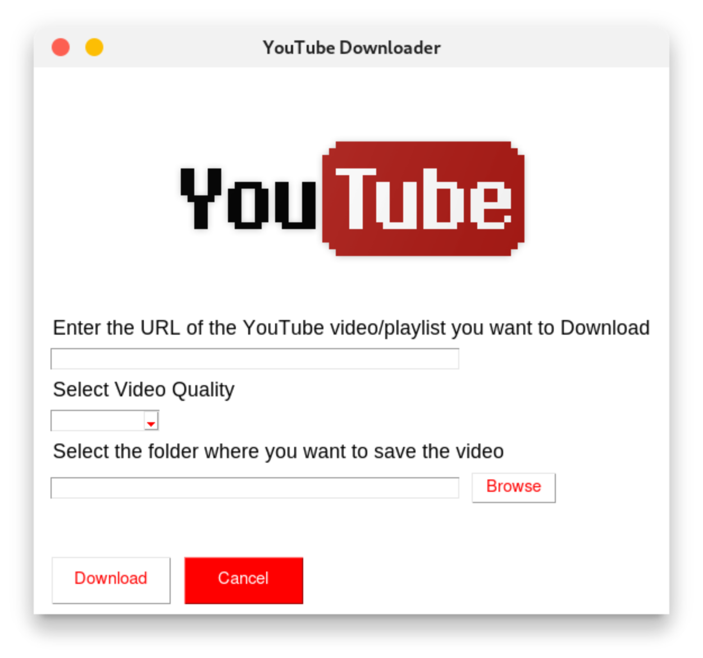

# YouTube Downloader
[](https://www.youtube.com)

Hello there just a simple project that can download videos or playlist from YouTube. This project is made using Python.

## Dependencies

To install the prerequisites run the following command in your terminal

```pip install -r requirements.txt```

Dependencies
- pytube
- PySimpleGUI

  
## Updated Software Packages

### For Windows Users:
- Download the `youtube-downloader.exe` from latest releases file and run it. If a warning about an untrusted developer appears, click "Run Anyway."

### For Debian (Ubuntu) Users:
- Download the `youtube-downloader.deb` file and install it using the command: `dpkg -i youtube-downloader.deb -y`

### For Other Linux Distributions:
- Execute the `youtube-downloader` binary by granting it executable permission: `chmod +x ./youtube-downloader` and then run it.

### For Mac Users:
- LoL, Do it the hard way Check `How to Run the project?` Section


## How to Run the project?
Just dobule click the `main.pyw` 

`.pyw` file is a Python script that runs without opening a console window, typically used for GUI applications or background tasks.

Make sure to install the prerequisites before running the project.

## Screenshot



## Contributions

Hell yeah! You can contribute to this project by adding new features or fixing bugs. Just fork the repo and make a PR.
